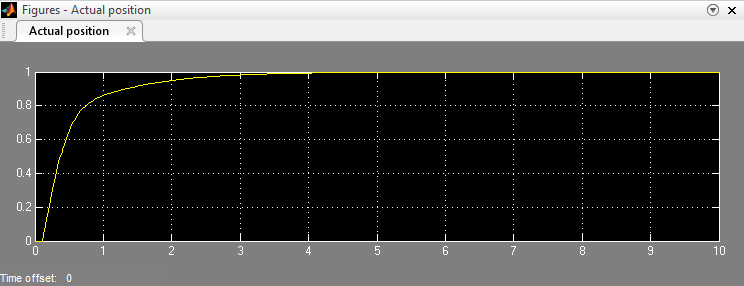
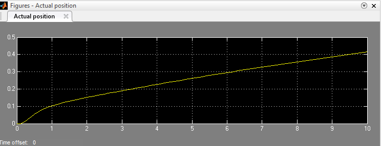
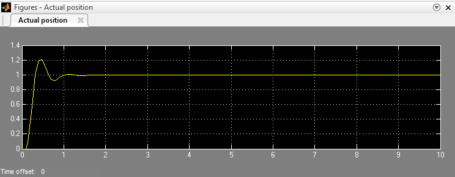

# PID-Motor-Control-Simulink
Simulation and tuning of a PID controller for a DC Motor.
# DC Motor Speed Control via PID (Simulink)

## My Learning Journey
This project is a big step in my mechatronics and control systems learning. I wanted to move beyond just reading about PIDs and actually *see* one in action. This repo holds my **Simulink model** and the results of my tuning process.

### The Setup
I modeled the motor using a second-order transfer function to understand how inertia and friction affect behavior:
$$G(s) = \frac{1}{s^2+10s+20}$$

---

## 💡 The "Aha!" Moments (and "Oh No" Moments)

It wasn't all smooth sailing. My first few attempts were... educational:

* **The "Where's the Motor?" Phase:** Initially, I couldn't see any response! I realized I hadn't given the simulation enough time to run. **Lesson:** Always check your simulation time scales.
* **The Noise Nightmare:** I added white noise to make it realistic, but turned it up too high. Finding the right balance for noise was a great lesson in real-world signal challenges.
* **Hitting the Ceiling:** I ran into **Saturation** issues. It showed me why understanding the physical limits of hardware (like voltage caps) is critical.

---

## 🛠️ The Results: Tuning the "Brain"

I analyzed three main scenarios to see how the **P, I, and D** terms actually "feel":

### 1. The "Just Right" Spot (Critically Damped)
**Parameters:** P=30, I=40, D=2
This was the most satisfying part. I got a response that's both fast and steady with **zero overshoot**.

### 2. Playing it Safe (Overdamped)
**Parameters:** P=2, I=1, D=0
It was stable, but way too slow for a real robot.

### 3. Going Too Fast (Underdamped)
**Parameters:** P=100, I=200, D=0
The motor shot up fast but couldn't stop! It overshot and wobbled. 

---

## 🚀 Moving Forward
This project taught me the intuitive feel for PID controllers. My next goal is to move from simulation to **real hardware** using an Arduino or STM32 to implement this logic in C++.
